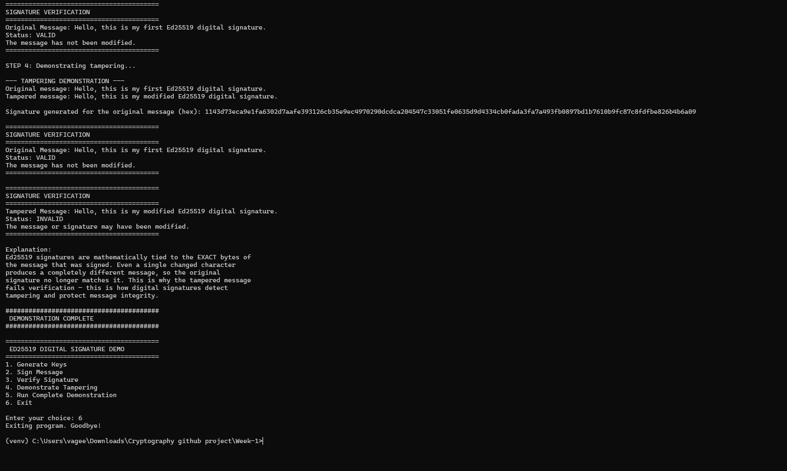
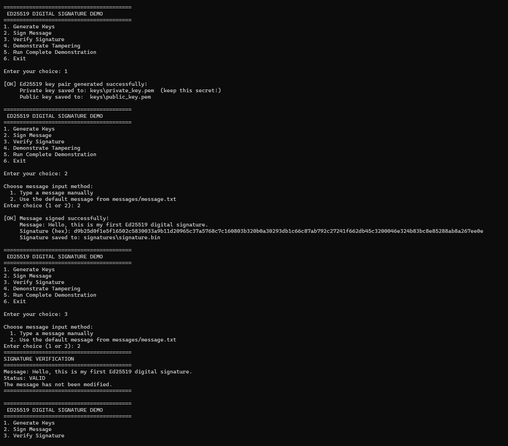
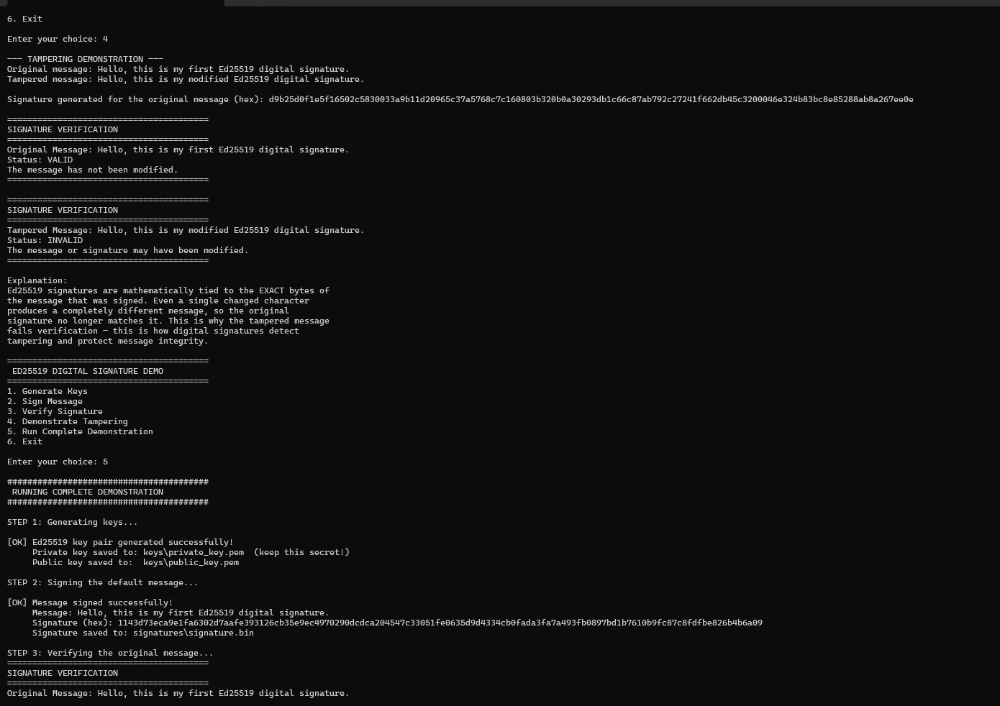

# Week-1 — Ed25519 Digital Signature Demo (Sample Run with Screenshots)

This file shows a **real recorded run** of the `Week-1` program, with
terminal screenshots, so you (or your professor) can see exactly what the
output looks like without having to run it yourself.

> Place this file inside the `Week-1` folder, and put the three screenshot
> images inside a subfolder named `screen-shots/` next to it, named:
> `week-1-sc1.png`, `week-1-sc2.png`, `week-1-sc3.png`.
>
> ```
> Week-1/
> ├── README-DEMO.md          ← this file
> ├── screen-shots/
> │   ├── week-1-sc1.png
> │   ├── week-1-sc2.png
> │   └── week-1-sc3.png
> ├── main.py
> └── ...
> ```

---

## Part 1 — Key Generation, Signing, and Verification (Options 1 → 2 → 3)

The screenshot below shows the menu being used to:
1. Generate a new Ed25519 key pair (Option 1).
2. Sign the default message from `messages/message.txt` (Option 2).
3. Verify that same message against the saved signature (Option 3),
   which correctly returns **VALID**.



Notice that:
- The private key is saved to `keys\private_key.pem` and is **never**
  printed to the screen — only a confirmation message is shown.
- The signature is displayed in hex format and saved to
  `signatures\signature.bin`.
- Verifying the untouched original message returns `Status: VALID`.

---

## Part 2 — Tampering Demonstration and Full Automated Demo (Options 4 → 5)

The next screenshot shows Option 4 (Demonstrate Tampering) followed by
Option 5 (Run Complete Demonstration), which repeats the entire workflow
automatically from scratch.



Key things to notice:
- The **original message** is signed, and verifying it returns **VALID**.
- The **tampered message** (`"...modified Ed25519 digital signature."`
  instead of `"...first Ed25519 digital signature."`) is checked against
  the **same signature**, and verification correctly returns **INVALID**.
- The program explains *why* this happens: Ed25519 signatures are
  mathematically tied to the exact bytes of the signed message, so even a
  one-word change breaks verification.
- Option 5 then re-runs the whole pipeline (generate → sign → verify →
  tamper) automatically in one go — ideal for a live presentation.

---

## Part 3 — Full Demonstration Output and Clean Exit

The final screenshot shows the rest of the automated demonstration output
completing successfully, followed by exiting the program (Option 6).



At the end you can see the terminal returns to the activated virtual
environment prompt:

```
(venv) C:\Users\...\Week-1>
```

confirming the program ran to completion with no errors.

---

## Summary of What This Run Proves

| Step | Action | Result |
|------|--------|--------|
| 1 | Generate Ed25519 key pair | Keys saved to `keys/` folder |
| 2 | Sign default message | Signature saved to `signatures/signature.bin` |
| 3 | Verify original message | **VALID** |
| 4 | Verify tampered message (same signature) | **INVALID** |
| 5 | Run full automated demo | All steps repeat successfully end-to-end |

This confirms the core property of digital signatures demonstrated in
this project: **any change to a signed message, however small, causes
verification to fail**, proving the signature detects tampering and
protects message integrity.
