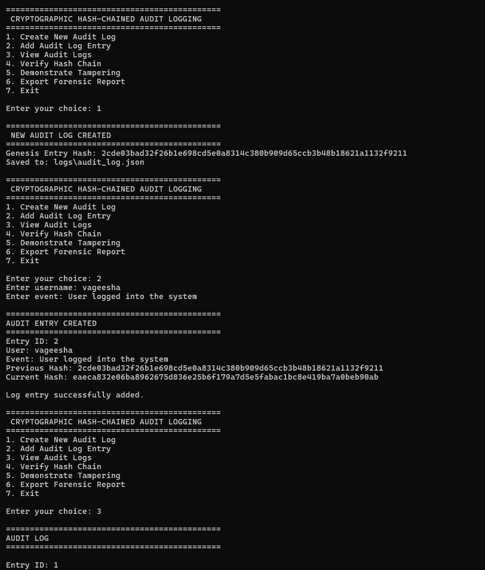
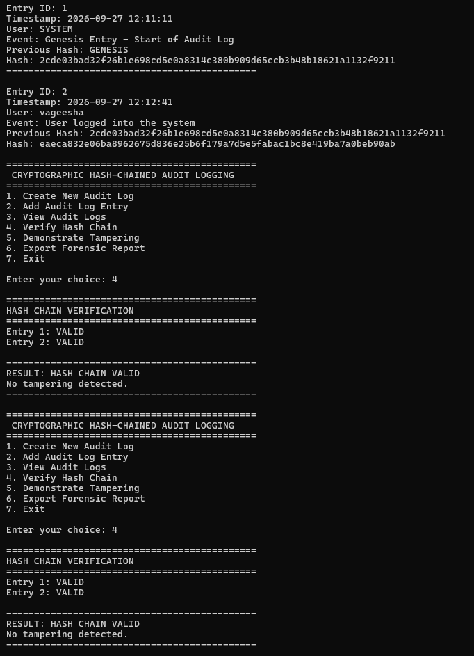
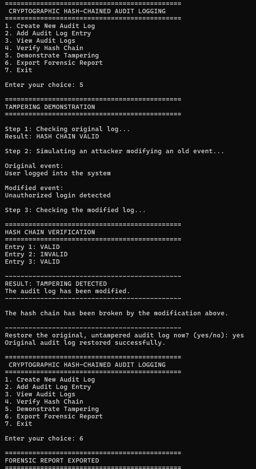
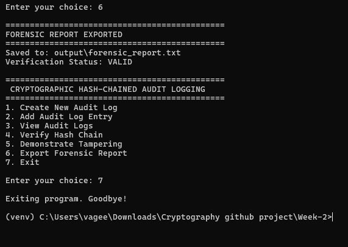

# Week-2 — Demo Run with Screenshots

This file documents an actual execution of the Cryptographic Hash-Chained
Audit Logging System, with screenshots of every step.

> **Setup:** Before this file will display images correctly, create a
> folder named `screen-shots` inside your `Week-2` project folder, and
> save your screenshots there using these exact filenames:
>
> ```
> Week-2/
> ├── README.md
> ├── WEEK-2-DEMO.md          <-- this file
> ├── screen-shots/
> │   ├── week-2-sc1.png
> │   ├── week-2-sc2.png
> │   ├── week-2-sc3.png
> │   └── week-2-sc4.png
> ├── main.py
> └── ...
> ```

---

## Step 1 — Create New Audit Log, Add an Entry, View Logs

The program starts, a brand-new audit log is created (generating the
Genesis Entry), a second entry is added for user `vageesha`, and the
log is displayed with Option 3.



**What happened:**
- Option `1` created a new audit log and printed the Genesis Entry hash.
- Option `2` added Entry ID 2 (`User logged into the system`) linked to
  the Genesis Entry's hash as its `previous_hash`.
- Option `3` began displaying both entries in the log.

---

## Step 2 — View Full Log Details and Verify the Chain

The full details of Entry 1 (Genesis) and Entry 2 are shown, followed by
running Option 4 (Verify Hash Chain) twice — both times confirming the
chain is intact.



**What happened:**
- Entry 1 shows `previous_hash: GENESIS`, marking the start of the chain.
- Entry 2's `previous_hash` matches Entry 1's `hash` exactly, confirming
  the link.
- Option `4` recalculates every hash and reports: `RESULT: HASH CHAIN
  VALID — No tampering detected.`

---

## Step 3 — Tampering Demonstration

Option `5` is run. The program backs up the log, confirms it starts out
valid, then simulates an attacker silently changing an old event from
`"User logged into the system"` to `"Unauthorized login detected"`.
Verification is run again and catches the change. The user then chooses
to restore the original, clean log.



**What happened:**
- Step 1 of the demo confirmed the log was `HASH CHAIN VALID` beforehand.
- Step 2 modified Entry 2's event text without recalculating its hash —
  exactly what an attacker editing a file by hand would do.
- Step 3 re-verified the log: `Entry 2: INVALID`, and the overall result
  changed to `RESULT: TAMPERING DETECTED — The audit log has been
  modified.`
- Answering `yes` restored the original, untampered log from the backup
  in `evidence/audit_log_backup.json`.

---

## Step 4 — Export Forensic Report and Exit

Option `6` exports a forensic report to `output/forensic_report.txt`,
confirming the log is `VALID`. Option `7` exits the program cleanly.



**What happened:**
- The forensic report was saved to `output\forensic_report.txt`.
- Verification Status in the report: `VALID`.
- The program exited cleanly back to the command prompt.

---

## Summary

This run demonstrates the full lifecycle of the tamper-evident audit
logging system:

1. **Create** a hash-chained log, starting from a Genesis Entry.
2. **Add** entries, each cryptographically linked to the one before it.
3. **Verify** that the chain is valid using SHA-256 recalculation.
4. **Detect** tampering the moment an old entry is silently modified.
5. **Restore** the clean log safely from a backup.
6. **Export** a forensic report documenting the verification result.

This is the exact flow to reproduce live during a college viva
demonstration — see `README.md` for the full write-up, viva Q&A, and
troubleshooting guide.
