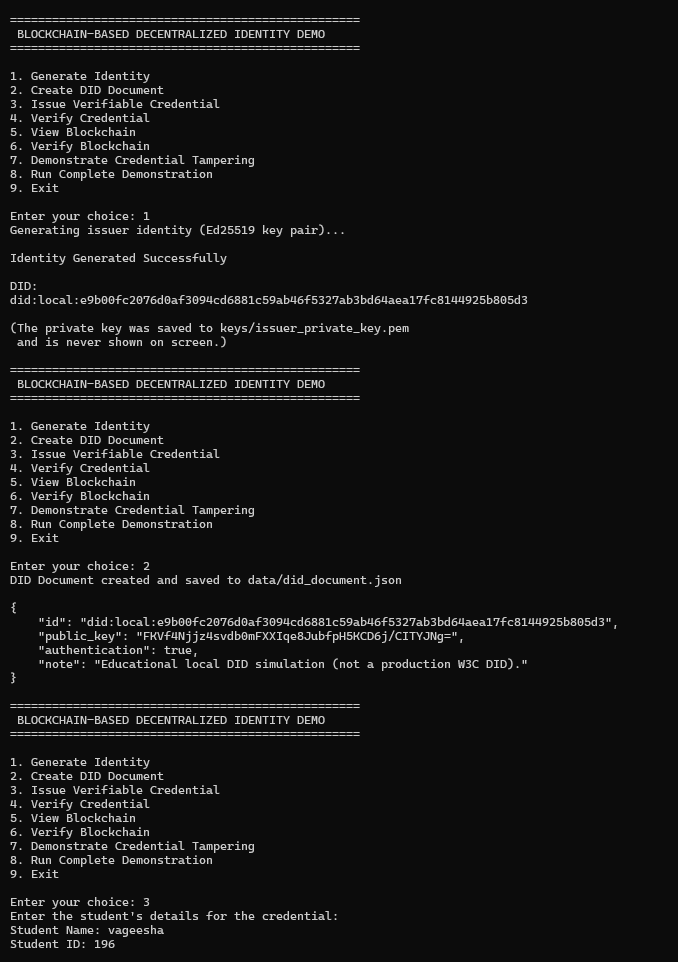
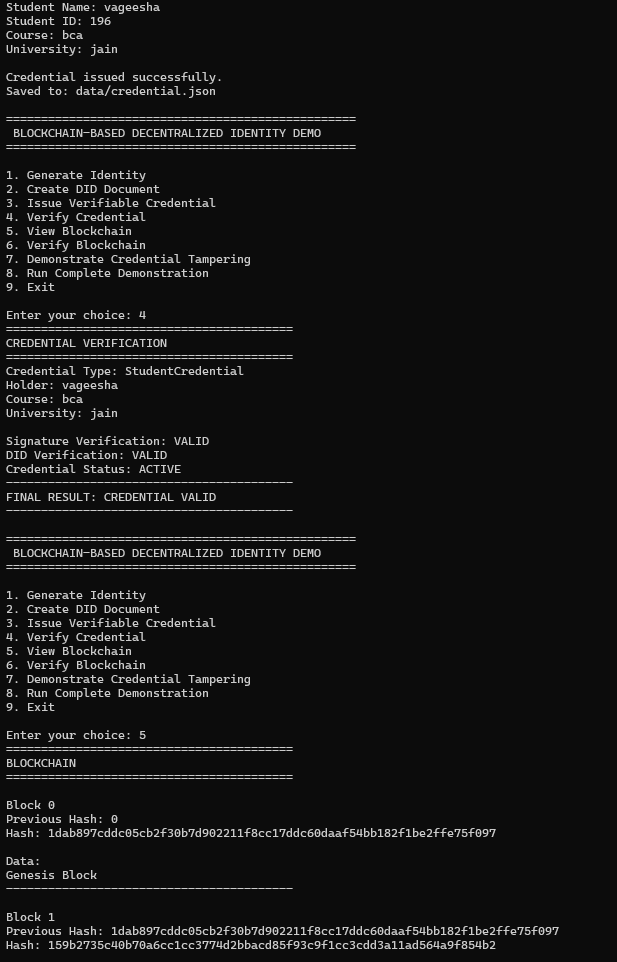
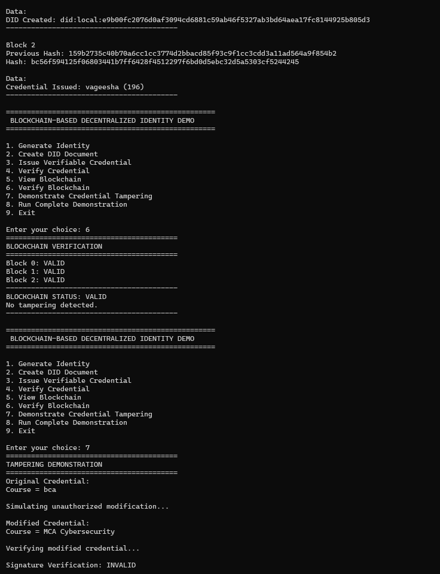
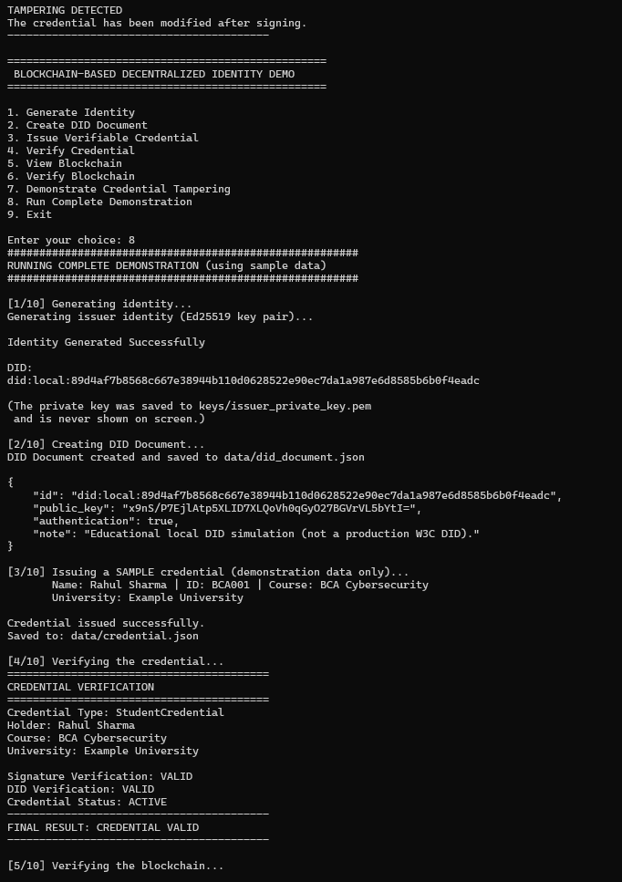
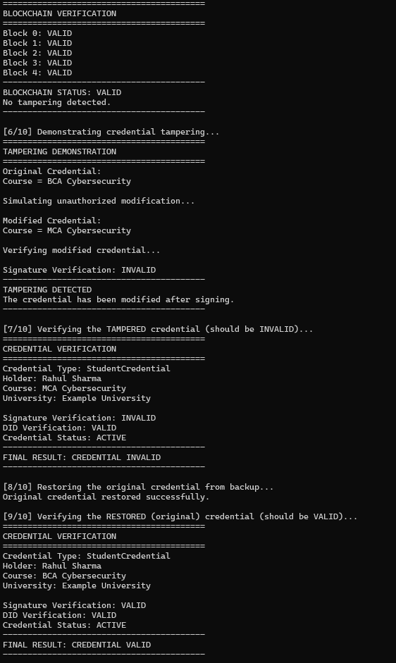

# Week-3 — Live Demo Run (Screenshots)

This file is a walkthrough of an actual run of `main.py`, using **Option 8
— Run Complete Demonstration**, with terminal screenshots for each stage.
It is meant to be shown alongside `README.md` during the college
demonstration/viva, so the professor can see the real output on screen.

> Screenshots are stored in the `screen-shots/` folder next to this file:
> `screen-shots/week-3-sc1.png` through `screen-shots/week-3-sc5.png`.

---

## 1. Menu, Identity Generation, and DID Document Creation

The program starts with the main menu. Option **1** generates the
issuer's Ed25519 key pair and derives a DID from the public key (the
private key is saved to `keys/issuer_private_key.pem` and is never
printed). Option **2** then builds and prints the DID Document, which
publishes the public key for later verification.

---

## 2. Issuing a Credential and Verifying It

Option **3** prompts for the student's details (name, ID, course,
university), builds the Verifiable Credential, signs it with the issuer's
private key, and saves it to `data/credential.json`. Option **4** then
verifies the credential's signature and DID using only public
information, resulting in `FINAL RESULT: CREDENTIAL VALID`. Option **5**
starts displaying the local blockchain (Genesis Block and Block 1).

---

## 3. Blockchain Record and Verification

Block 2 shows the "Credential Issued" event recorded on the chain, linked
to the previous block's hash. Option **6** recalculates every block's
hash and checks the previous-hash links, reporting
`BLOCKCHAIN STATUS: VALID — No tampering detected`. Option **7** then
begins the tampering demonstration by changing the course field after
signing.

---

## 4. Tampering Detected + Complete Demonstration Started

The modified credential (`Course = MCA Cybersecurity`) fails signature
verification — `TAMPERING DETECTED`. This confirms that any change made
after signing is caught. The screenshot also shows Option **8** starting:
the Complete Demonstration re-runs the entire flow automatically using
labeled sample data (Rahul Sharma / BCA001 / Example University).

---

## 5. Full Automated Flow: Verify → Tamper → Restore → Re-verify

The final screenshot shows the automated sequence from Option 8:
blockchain re-verified as VALID, tampering demonstrated again
(`Signature Verification: INVALID`), the tampered credential explicitly
re-checked (`FINAL RESULT: CREDENTIAL INVALID`), the original credential
restored from `output/credential_backup.json`, and the restored
credential verified again (`FINAL RESULT: CREDENTIAL VALID`).

---

## Summary

| Step | Action | Result Shown |
|---|---|---|
| 1 | Generate Identity | DID printed, private key never shown |
| 2 | Create DID Document | Public key published in `did_document.json` |
| 3 | Issue Verifiable Credential | Credential signed and saved |
| 4 | Verify Credential | `FINAL RESULT: CREDENTIAL VALID` |
| 5 | View Blockchain | Genesis → DID Created → Credential Issued blocks |
| 6 | Verify Blockchain | `BLOCKCHAIN STATUS: VALID` |
| 7 | Demonstrate Tampering | `TAMPERING DETECTED` after course field changed |
| 8 | Complete Demonstration | Full flow repeated end-to-end automatically, ending with restore + re-verification as VALID |

These screenshots correspond exactly to the steps described in the
**"Recommended College Demonstration"** section of `README.md`.
